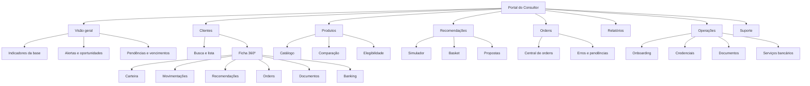
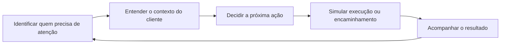

# Portal Web do Consultor — Épico e Histórias de Usuário

**Produto:** Portal Web do Consultor
**Versão:** 1.1 — Protótipo mockado
**Data:** 20/07/2026
**Status:** Escopo para protótipo web navegável, 100% mockado, destinado à validação de conceito, arquitetura, fluxos e experiência

> Documento de origem do épico do Portal (segundo protótipo deste repositório, distinto do CX Journey Mapper). Serve de fonte de verdade para as histórias de usuário implementadas em `Portal/`, na mesma lógica que `especificacao_projeto_customer_journey.docx` é a fonte do `GOVERNANCA.md` da Jornada. Ver também `Portal/design.md` para os tokens de design usados na implementação.

---

## 0. Premissa obrigatória do protótipo

Esta etapa será construída como um **portal web totalmente mockado**. O objetivo é validar a proposta de valor, a arquitetura de informação, a hierarquia das telas, os fluxos e a compreensão dos usuários antes de qualquer integração técnica.

### O que significa "100% mockado"

- não haverá conexão com APIs, serviços, bancos de dados ou sistemas do Inter;
- não haverá autenticação real, integração com identidade ou controle de acesso produtivo;
- nenhum saldo, cliente, ordem, documento ou dado pessoal será real;
- todas as informações serão sintéticas e armazenadas em fixtures locais, arquivos JSON ou estruturas equivalentes no front-end;
- ações como enviar recomendação, reenviar convite, aprovar ordem, abrir chamado, bloquear conta ou baixar documento serão apenas simuladas;
- mudanças de status acontecerão somente no estado local do protótipo e poderão ser reiniciadas;
- erros, carregamentos, indisponibilidades e permissões serão representados por cenários controlados;
- nenhum fluxo produzirá efeito financeiro, operacional, regulatório ou comunicacional fora do protótipo.

### Resultado esperado desta etapa

Ao final, deve existir um protótipo web navegável com fidelidade suficiente para:

1. apresentar a visão futura do Portal do Consultor;
2. demonstrar jornadas ponta a ponta;
3. realizar testes de usabilidade com consultores e demais perfis;
4. validar prioridades antes da construção de backend e integrações;
5. produzir insumos para um backlog técnico futuro.

> Toda menção a dados, status, regras, permissões, notificações ou operações neste documento deve ser interpretada como **simulação de interface e comportamento**, salvo indicação explícita de evolução futura.

---

## 1. Contexto

As entrevistas com Nathalia Bunzen e Lucas Lana mostram que o Portal atual atende tarefas básicas, como consulta de posição, geração de relatórios e envio de algumas ordens, mas ainda não ocupa o papel de ambiente central de trabalho da consultoria.

A dor mais recorrente é a falta de uma visão integrada e acionável do cliente. Para entender o que aconteceu, decidir a próxima ação e executar uma operação, os profissionais precisam alternar entre o Portal, planilhas, consolidadores, suporte, sistemas internos e plataformas concorrentes.

O Portal proposto deve evoluir de um canal de consulta e operação pontual para um **workspace de gestão, atendimento e atuação consultiva**, combinando:

1. visão consolidada da base;
2. contexto completo do cliente;
3. alertas e oportunidades acionáveis;
4. ferramentas para recomendar e operar;
5. acompanhamento transparente das operações;
6. representação da integração futura com o ecossistema da consultoria, sem conexão real nesta etapa.

---

## 2. Evidências consideradas

### Entrevista — Nathalia Bunzen

Principais necessidades identificadas:

- busca por nome, CPF, e-mail e número da conta;
- identificação da origem do saldo e do caixa investível;
- data de aplicação e informações completas da posição;
- status em massa de ativação, segmentação, ordens e pendências;
- autonomia para documentos, credenciais, bloqueios, cartão e banking;
- suporte contextual e rastreável;
- visão gerencial da base;
- operação de contas PJ e holdings;
- necessidade futura de dados mais atualizados e integração com o ecossistema; nesta etapa, os cenários serão representados por dados sintéticos.

### Entrevista — Lucas Lana

Principais necessidades identificadas:

- ambiente profissional separado da conta pessoal;
- dashboard com saldo parado, vencimentos, captação e oportunidades;
- ficha completa do cliente;
- carteira organizada por classe de ativo;
- necessidade futura de integração com consolidadores, representada no protótipo por importação e atualização simuladas;
- simulador de carteira e comparação entre atual e proposta;
- relatório white-label;
- central de ordens;
- basket e recomendação em lote;
- navegação orientada às tarefas do consultor.

### Referências de mercado

As referências de XP e BTG devem orientar padrões de completude, produtividade e organização, sem replicar interfaces ou fluxos de forma literal.

**Padrões associados à XP nas entrevistas:**

- visão da base e oportunidades;
- ficha detalhada do cliente;
- asset allocation;
- simuladores e ferramentas consultivas;
- histórico de ordens;
- basket e aprovação consolidada;
- organização por produtos e tarefas;
- abertura para integrações futuras com o ecossistema, sem implementação nesta etapa.

**Padrões associados ao BTG nas entrevistas:**

- relatórios atualizados;
- banking e cartão;
- suporte por tema;
- operação de PJ;
- notificações;
- ferramentas de investimento e construção de carteira;
- experiência modular e integrada.

---

## 3. Visão do produto

> Um workspace web que permite ao consultor saber quem precisa de atenção, compreender o contexto financeiro do cliente e simular ou acompanhar a próxima ação em um único ambiente.

### Proposta de valor

> **Saiba quem precisa de você, entenda o contexto e aja em um único lugar.**

### Resultado esperado

Validar se uma experiência integrada pode reduzir a percepção de fragmentação e aumentar a capacidade do consultor de compreender prioridades, tomar decisões e acompanhar tarefas em um único ambiente.

---

# 4. Épico

## EP-01 — Central de Visão e Ação do Consultor

### Declaração do épico

**Como** profissional de uma consultoria de investimentos,
**quero** visualizar minha base, compreender a situação de cada cliente e simular ou acompanhar ações em um ambiente integrado,
**para** trabalhar de forma mais proativa, segura e escalável, sem depender de consultas manuais, planilhas, suporte informal ou plataformas concorrentes.

### Problema a resolver

As informações e ações necessárias para atender e orientar o cliente estão fragmentadas. O consultor precisa procurar dados em diferentes fontes, não recebe sinais claros sobre onde atuar e tem baixa autonomia para executar ou acompanhar várias tarefas da jornada.

### Objetivos do épico

- criar uma visão única da base e do cliente;
- reduzir o tempo para encontrar informações e identificar prioridades;
- aumentar a confiança nos dados apresentados;
- transformar alertas em fluxos acionáveis e demonstráveis;
- permitir acompanhamento ponta a ponta de recomendações e ordens;
- melhorar a produtividade em operações individuais e em massa;
- validar oportunidades de redução de acionamentos manuais de suporte.

### Hipóteses de sucesso

- consultores conseguem identificar os clientes prioritários logo na home;
- usuários conseguem percorrer tarefas recorrentes sem sair do protótipo;
- o tempo para localizar um cliente e compreender sua situação diminui;
- saldos, vencimentos, pendências e erros passam a ser tratados de forma proativa;
- recomendações e ordens possuem maior rastreabilidade;
- a proposta demonstra potencial para aumentar a participação do Inter na rotina consultiva.

### Métricas sugeridas para validação do protótipo

Estas métricas devem ser coletadas em testes moderados ou não moderados. Não representam indicadores produtivos do Portal.

| Métrica | Definição | Direção esperada |
|---|---|---|
| Sucesso por tarefa | Participantes que concluem o fluxo sem intervenção | Aumentar |
| Tempo por tarefa | Tempo para localizar cliente, interpretar alerta ou acompanhar ordem | Reduzir |
| Erros de navegação | Cliques incorretos, retornos e becos sem saída | Reduzir |
| Compreensão dos dados | Participantes que interpretam corretamente saldo, carteira, status e alertas | Aumentar |
| Clareza da próxima ação | Participantes que identificam o que fazer após visualizar um evento | Aumentar |
| Confiança percebida | Avaliação da segurança e confiabilidade transmitida pela interface | Melhorar |
| CES do fluxo | Esforço percebido para concluir cada jornada | Reduzir |
| Valor percebido | Intenção declarada de usar a solução na rotina | Aumentar |

---

## 5. Perfis e permissões

O protótipo deve simular controle de acesso baseado em função e escopo de carteira. Os perfis poderão ser alternados por um seletor de cenário, sem autenticação real.

| Perfil | Necessidades principais | Exemplos de permissão |
|---|---|---|
| Consultor | relacionamento, recomendação e acompanhamento | visualizar clientes fictícios, criar proposta e simular envio de recomendação |
| Alocador | análise e execução de alocação | consultar carteira, filtrar elegibilidade, criar basket e simular envio de ordens |
| Daily Banker | atendimento e operação | consultar status e simular serviços, documentos e solicitações |
| Gestor do escritório | visão gerencial e governança | visualizar base consolidada, produtividade, riscos e pendências |
| Administrador | configuração e gestão de acessos | alternar cenários e simular usuários, vínculos, papéis e limites |

### Regras transversais de segurança representadas no protótipo

- simular a exibição somente de clientes vinculados ao perfil ou escritório selecionado;
- usar apenas dados fictícios e simular mascaramento conforme o perfil selecionado;
- representar autenticação reforçada por modal ou etapa demonstrativa, sem validação real;
- representar uma trilha de auditoria fictícia com autor, data, horário, cliente e resultado;
- simular segregação de funções entre recomendação, aprovação e execução;
- apresentar termos, riscos, custos e elegibilidade antes da confirmação de operações;
- representar avisos e restrições de LGPD, suitability e compliance para validar compreensão; a aderência técnica e regulatória real será tratada em fase futura.

---

# 6. Arquitetura de informação proposta

A arquitetura abaixo representa páginas e fluxos do protótipo. Os módulos não pressupõem serviços reais, integrações ativas ou persistência produtiva.

### Elementos persistentes

- menu lateral orientado às tarefas;
- busca global no topo;
- central de alertas;
- acesso rápido ao suporte;
- identificação do usuário, escritório e escopo de atuação;
- breadcrumb em páginas profundas;
- indicação fictícia do horário de atualização dos dados e opção de alternar cenários de atualização.

---

# 7. Histórias de usuário

## MVP — Visão, contexto e acompanhamento

---

## US-01 — Acessar um ambiente exclusivo do consultor

> **Natureza desta etapa:** fluxo e comportamento simulados com dados fictícios.

**Prioridade:** P0
**Origem:** Lucas D02, D03
**Dependências do protótipo:** rota de acesso, seletor de perfil, usuários fictícios e vínculos simulados

**Como** consultor,
**quero** acessar um ambiente profissional separado da minha conta pessoal,
**para** trabalhar com mais clareza, segurança e foco nas tarefas da consultoria.

### Critérios de aceite

1. O usuário deve acessar o protótipo por uma entrada exclusiva simulada para profissionais.
2. A interface não deve misturar saldos, produtos ou ações da conta pessoal do profissional com os dados dos clientes.
3. O Portal deve exibir o nome do profissional, escritório, função e escopo de carteira ativo.
4. O menu deve ser organizado por tarefas: visão geral, clientes, produtos, recomendações, ordens, relatórios, operações e suporte.
5. Um cenário de usuário sem vínculo ou permissão deve exibir mensagem clara e caminho fictício de regularização.
6. O protótipo deve representar timeout, autenticação reforçada e restrições por meio de estados e mensagens demonstrativas.

---

## US-02 — Visualizar a home com prioridades da base

> **Natureza desta etapa:** fluxo e comportamento simulados com dados fictícios.

**Prioridade:** P0
**Origem:** Nathalia D12, D20; Lucas D10, D16, D17
**Dependências do protótipo:** dataset sintético de clientes, carteira, movimentações, vencimentos, ordens e alertas

**Como** consultor ou gestor,
**quero** visualizar os principais indicadores, pendências e oportunidades da minha base,
**para** decidir rapidamente onde concentrar minha atenção.

### Conteúdo mínimo da home

- patrimônio total da base;
- captação e retirada no período;
- saldo disponível e possível caixa investível;
- clientes com vencimentos próximos;
- clientes com pendências cadastrais ou operacionais;
- ordens aguardando aprovação, em processamento ou com erro;
- clientes recém-ativados;
- alertas prioritários;
- atalhos para ações frequentes.

### Critérios de aceite

1. Os indicadores devem respeitar o escopo de clientes do usuário.
2. Cada card deve apresentar valor, período de referência e timestamp de atualização.
3. O usuário deve conseguir filtrar por período, escritório, consultor, segmento e status, conforme permissão.
4. Clicar em um indicador deve abrir a lista de clientes ou eventos que compõem o número.
5. Alertas devem possuir nível de prioridade, prazo, cliente, motivo e próxima ação sugerida.
6. O usuário deve conseguir marcar um alerta como visualizado, em tratamento ou concluído.
7. O sistema deve diferenciar indisponibilidade de dados, valor zero e ausência de permissão.

---

## US-03 — Buscar clientes por diferentes identificadores

> **Natureza desta etapa:** fluxo e comportamento simulados com dados fictícios.

**Prioridade:** P0
**Origem:** Nathalia D01
**Dependências do protótipo:** lista local de clientes fictícios, busca client-side e cenários de permissão

**Como** profissional da consultoria,
**quero** buscar um cliente por nome, CPF, e-mail, telefone ou número da conta,
**para** localizar sua ficha sem depender de consultas paralelas.

### Critérios de aceite

1. A busca global deve aceitar nome completo ou parcial, CPF, e-mail, telefone e número da conta.
2. A lista de resultados deve exibir dados suficientes para diferenciar homônimos, respeitando mascaramento e permissões.
3. O resultado deve apresentar status da conta, consultor responsável e tipo de pessoa: PF ou PJ.
4. O sistema deve tolerar CPF com ou sem pontuação e telefone com diferentes formatações.
5. Clientes fora do escopo do usuário não devem ser exibidos.
6. Quando não houver resultado, o Portal deve oferecer caminhos compatíveis, como revisar a busca ou iniciar uma solicitação de vínculo.
7. A busca deve responder de forma fluida com dados locais; o protótipo poderá simular latência para testar estados de carregamento.

---

## US-04 — Consultar a ficha 360º do cliente

> **Natureza desta etapa:** fluxo e comportamento simulados com dados fictícios.

**Prioridade:** P0
**Origem:** Nathalia D03; Lucas D04
**Dependências do protótipo:** ficha sintética, abas navegáveis, suitability e vínculos simulados

**Como** consultor,
**quero** consultar uma ficha completa e organizada do cliente,
**para** compreender seu contexto antes de orientar ou executar uma ação.

### Informações mínimas

- nome e identificadores;
- contatos autorizados;
- conta e segmento;
- consultor e escritório responsáveis;
- status cadastral e de ativação;
- perfil de investidor e validade do suitability;
- patrimônio, saldo e carteira resumida;
- alertas e pendências;
- últimas movimentações;
- ordens recentes;
- documentos disponíveis;
- relacionamento PF, PJ e holdings, quando aplicável.

### Critérios de aceite

1. A ficha deve possuir um resumo no topo com contexto e principais ações.
2. As informações devem ser organizadas em abas ou seções consistentes.
3. Cada dado deve indicar sua origem e, quando relevante, o horário da última atualização.
4. Dados sensíveis devem respeitar o papel e a permissão do usuário.
5. O usuário deve acessar diretamente carteira, movimentações, recomendações, ordens, documentos e banking.
6. Pendências críticas devem ser destacadas sem impedir a leitura das demais informações.
7. Alterações e ações realizadas devem compor uma linha do tempo auditável.

---

## US-05 — Analisar a carteira por classe de ativo

> **Natureza desta etapa:** fluxo e comportamento simulados com dados fictícios.

**Prioridade:** P0
**Origem:** Nathalia D04; Lucas D05
**Dependências do protótipo:** posições e produtos fictícios, taxonomia mockada e componentes de tabela e gráficos

**Como** consultor ou alocador,
**quero** visualizar a carteira agrupada por classe de ativo e com dados completos da posição,
**para** avaliar a alocação de acordo com a estratégia usada pela consultoria.

### Critérios de aceite

1. A carteira deve permitir agrupamento por classe e subclasse de ativo.
2. O produto deve suportar, no mínimo, categorias como pós-fixado, prefixado, inflação, fundos, ações, FIIs, multimercado, previdência, global e caixa, conforme taxonomia aprovada.
3. Cada posição deve apresentar ativo, emissor, quantidade, valor atual, percentual da carteira, taxa, liquidez, data de aplicação e vencimento quando aplicável.
4. O usuário deve alternar entre visão por classe, produto, emissor e vencimento.
5. O Portal deve destacar concentração, vencimentos próximos e dados indisponíveis.
6. Deve existir uma indicação visível do timestamp da posição.
7. A visão deve permitir simular uma exportação padronizada, gerando um arquivo de exemplo local ou uma confirmação demonstrativa.

---

## US-06 — Entender a origem do saldo e o caixa investível

> **Natureza desta etapa:** fluxo e comportamento simulados com dados fictícios.

**Prioridade:** P0
**Origem:** Nathalia D02, D18, D19; Lucas D16
**Dependências do protótipo:** extrato sintético, categorias predefinidas e cenários de saldo

**Como** consultor,
**quero** identificar de onde veio o saldo disponível e se ele pode ser considerado investível,
**para** abordar o cliente de forma proativa sem confundir recursos de uso bancário com recursos destinados a investimento.

### Critérios de aceite

1. O Portal deve listar créditos e débitos recentes com data, valor, descrição e categoria de origem.
2. Eventos devem ser classificados, quando possível, como transferência, salário, vencimento, resgate, rendimento, dividendo, cashback, depósito ou outra categoria aprovada.
3. O sistema deve diferenciar saldo total, saldo disponível e estimativa de caixa investível.
4. Quando a origem não puder ser determinada, o evento deve ser marcado como não classificado.
5. O consultor deve poder filtrar clientes por entrada de recurso, vencimento ou saldo disponível.
6. O produto não deve apresentar a estimativa de caixa investível como uma autorização automática de investimento.
7. Dados de saldo e movimento devem exibir o horário de atualização.

---

## US-07 — Receber alertas e oportunidades acionáveis

> **Natureza desta etapa:** fluxo e comportamento simulados com dados fictícios.

**Prioridade:** P0
**Origem:** Nathalia D20; Lucas D10, D16, D17
**Dependências do protótipo:** biblioteca local de alertas, regras fictícias, filtros e estados controlados

**Como** consultor,
**quero** receber alertas priorizados sobre eventos relevantes da minha base,
**para** atuar antes que o cliente precise me procurar.

### Eventos iniciais sugeridos

- vencimento próximo;
- novo aporte ou entrada relevante;
- saldo parado;
- retirada relevante;
- suitability próximo do vencimento;
- cadastro pendente;
- cliente sem primeira aplicação;
- ordem aguardando aprovação;
- ordem com erro;
- documento disponível;
- risco de concentração, quando validado por Negócio e Compliance.

### Critérios de aceite

1. Cada alerta deve conter cliente, evento, data, prioridade, justificativa e ação recomendada.
2. O usuário deve filtrar por tipo, prioridade, período, status e responsável.
3. O alerta deve abrir diretamente o contexto necessário para tratamento.
4. O usuário deve registrar status, responsável, comentário e conclusão.
5. Alertas repetidos devem ser agrupados quando fizer sentido.
6. O protótipo deve oferecer cenários predefinidos de regras e limites; não é necessária uma configuração persistente real.
7. Toda recomendação automatizada deve deixar claro que se trata de um sinal de apoio, não de decisão autônoma.

---

## US-08 — Acompanhar onboarding, ativação e pendências

> **Natureza desta etapa:** fluxo e comportamento simulados com dados fictícios.

**Prioridade:** P0
**Origem:** Nathalia D08, D09
**Dependências do protótipo:** clientes fictícios em diferentes etapas, linha do tempo e comunicações simuladas

**Como** profissional da consultoria,
**quero** acompanhar em massa o status de convite, aceite, ativação, segmentação e pendências,
**para** não precisar consultar cada cliente ou acionar o suporte individualmente.

### Critérios de aceite

1. O Portal deve exibir uma lista com todos os clientes em onboarding dentro do escopo do usuário.
2. Os status devem possuir nomes claros, descrição e próxima ação.
3. O usuário deve filtrar por status, data, responsável, escritório e motivo de pendência.
4. O detalhe deve apresentar uma linha do tempo com convite, aceite, validações e ativação.
5. O sistema deve evitar linguagem de cobrança quando não existir cobrança efetiva.
6. O usuário deve conseguir simular o reenvio de comunicação e copiar instruções fictícias para o cliente.
7. Erros devem apresentar causa compreensível e canal de resolução.

---

## US-09 — Acompanhar ordens e falhas em uma central única

> **Natureza desta etapa:** fluxo e comportamento simulados com dados fictícios.

**Prioridade:** P0
**Origem:** Nathalia D14; Lucas D11
**Dependências do protótipo:** ordens fictícias, máquina local de estados e confirmações simuladas

**Como** consultor ou alocador,
**quero** acompanhar todas as ordens por cliente, ativo e status,
**para** saber o que foi enviado, aprovado, executado, recusado ou apresentou erro.

### Critérios de aceite

1. A central deve listar ordens com cliente, ativo, tipo, valor, autor, data de envio e status atual.
2. Os status mínimos devem incluir rascunho, enviada, aguardando aprovação, aprovada, em processamento, executada, parcialmente executada, recusada, cancelada e erro.
3. Cada ordem deve apresentar uma linha do tempo com timestamps.
4. Em caso de falha, o Portal deve informar motivo, ação recomendada e possibilidade de reenvio, quando permitido.
5. O usuário deve filtrar e exportar ordens por cliente, ativo, status, período e responsável.
6. Cancelamento ou reenvio devem abrir confirmação e alterar apenas o estado local da ordem fictícia.
7. O protótipo deve demonstrar a prevenção de comunicações duplicadas, sem enviar mensagens reais.

---

## Evolução — Recomendação, produtividade e autonomia

---

## US-10 — Navegar por um hub centralizado de produtos

> **Natureza desta etapa:** fluxo e comportamento simulados com dados fictícios.

**Prioridade:** P1
**Origem:** Lucas D03, D15
**Dependências do protótipo:** catálogo sintético, filtros client-side e regras fictícias de elegibilidade

**Como** consultor,
**quero** acessar os produtos por uma navegação centralizada e orientada às minhas tarefas,
**para** pesquisar alternativas sem precisar entrar previamente na conta de um cliente.

### Critérios de aceite

1. O hub deve organizar os produtos por classe e categoria.
2. A busca deve aceitar nome, emissor, indexador e identificadores do produto.
3. Os filtros devem incluir, quando aplicável, risco, prazo, liquidez, indexador, emissor, aplicação mínima e disponibilidade.
4. O usuário deve visualizar detalhes, documentos, riscos, custos e público elegível.
5. Ao selecionar um cliente, o Portal deve indicar elegibilidade e restrições.
6. Produtos indisponíveis não devem ser apresentados como contratáveis.
7. O usuário deve adicionar produtos fictícios a uma proposta ou recomendação simulada a partir do hub.

---

## US-11 — Simular uma carteira recomendada

> **Natureza desta etapa:** fluxo e comportamento simulados com dados fictícios.

**Prioridade:** P1 estratégica
**Origem:** Lucas D07, D08, D09
**Dependências do protótipo:** produtos e carteiras sintéticas, premissas fictícias e validações demonstrativas

**Como** consultor,
**quero** montar e simular uma carteira proposta com produtos disponíveis no Inter,
**para** estruturar uma recomendação coerente com o perfil e os objetivos do cliente.

### Critérios de aceite

1. O usuário deve iniciar a simulação a partir de um cliente ou de um modelo de carteira.
2. A ferramenta deve carregar perfil, patrimônio, carteira atual e restrições relevantes.
3. O consultor deve adicionar, remover e ajustar percentuais ou valores dos produtos.
4. O sistema deve validar total alocado, aplicação mínima, disponibilidade, concentração e elegibilidade.
5. O simulador deve mostrar alocação por classe antes e depois da proposta.
6. Premissas, dados históricos e limitações devem ser explicitados.
7. A simulação deve poder ser salva como rascunho, versionada e enviada para revisão, conforme governança.
8. O produto não deve prometer rentabilidade futura ou ocultar riscos.

---

## US-12 — Comparar carteira atual e proposta e gerar relatório white-label

> **Natureza desta etapa:** fluxo e comportamento simulados com dados fictícios.

**Prioridade:** P1
**Origem:** Lucas D08, D18
**Dependências do protótipo:** US-11, template local de relatório, marca fictícia e avisos demonstrativos

**Como** consultor,
**quero** comparar a carteira atual com a proposta e gerar um material personalizado,
**para** explicar de forma clara a recomendação ao cliente.

### Critérios de aceite

1. A comparação deve apresentar alocação atual e proposta por classe de ativo.
2. Deve destacar inclusões, reduções, concentrações e mudanças relevantes.
3. Indicadores históricos ou de risco somente devem aparecer quando houver fonte e metodologia aprovadas.
4. O relatório deve conter data, responsável, cliente, premissas, riscos e avisos regulatórios.
5. A marca do escritório poderá ser aplicada somente quando houver autorização e configuração válida.
6. O protótipo deve gerar uma prévia ou arquivo local de exemplo e representar o registro da versão enviada.
7. Dados desatualizados ou incompletos devem ser sinalizados antes da geração.

---

## US-13 — Criar basket e recomendações em lote

> **Natureza desta etapa:** fluxo e comportamento simulados com dados fictícios.

**Prioridade:** P1
**Origem:** Nathalia D15; Lucas D13, D14
**Dependências do protótipo:** clientes e produtos sintéticos, seleção em massa e validações fictícias

**Como** alocador ou consultor autorizado,
**quero** montar recomendações com múltiplos ativos ou para múltiplos clientes,
**para** operar em escala sem gerar uma sequência excessiva de ações e aprovações.

### Critérios de aceite

1. O usuário deve criar um basket por cliente com múltiplos ativos.
2. Perfis autorizados devem poder iniciar uma recomendação por ativo para múltiplos clientes elegíveis.
3. A seleção em massa deve permitir filtros por segmento, perfil, caixa, carteira, consultor e elegibilidade.
4. O Portal deve validar individualmente limites, suitability, disponibilidade e aplicação mínima.
5. Clientes inelegíveis devem ser excluídos ou destacados com o motivo.
6. O protótipo deve exibir a prévia de um resumo consolidado, sem enviar pushes ou mensagens reais.
7. A aprovação e execução devem manter rastreabilidade por cliente e por item.
8. Nenhuma seleção em massa deve ignorar regras individuais de risco ou consentimento.

---

## US-14 — Resolver serviços operacionais e acessar documentos

> **Natureza desta etapa:** fluxo e comportamento simulados com dados fictícios.

**Prioridade:** P1
**Origem:** Nathalia D05, D06, D07
**Dependências do protótipo:** documentos fictícios, modais de confirmação, protocolos e trilha simulada

**Como** Daily Banker ou profissional autorizado,
**quero** consultar e executar serviços operacionais permitidos,
**para** resolver demandas do cliente sem depender de canais informais.

### Capacidades candidatas

- consultar e baixar informes de rendimento;
- consultar documentos e comprovantes;
- iniciar reset de credencial ou token;
- solicitar bloqueio preventivo;
- consultar status de conta;
- visualizar informações de cartão, limite e fatura conforme permissão;
- abrir solicitações de banking;
- acompanhar solicitações até a conclusão.

### Critérios de aceite

1. Cada serviço deve informar claramente quem pode executá-lo e quais validações são necessárias.
2. Ações sensíveis devem exigir autenticação reforçada, justificativa e registro de auditoria.
3. Quando a ação direta não for permitida, o protótipo deve simular a abertura de uma solicitação contextualizada.
4. O usuário deve acompanhar protocolo, prazo, responsável e status fictícios.
5. Documentos devem ser filtráveis por cliente, tipo e ano.
6. O protótipo deve representar downloads e ações relevantes em uma trilha local fictícia.
7. Informações de cartão e banking devem seguir o princípio do menor privilégio.

---

## US-15 — Solicitar suporte dentro do contexto da tarefa

> **Natureza desta etapa:** fluxo e comportamento simulados com dados fictícios.

**Prioridade:** P1
**Origem:** Nathalia D13
**Dependências do protótipo:** tickets fictícios, histórico local, prazos e responsáveis simulados

**Como** profissional da consultoria,
**quero** abrir e acompanhar um atendimento a partir do cliente ou da operação em que ocorreu o problema,
**para** evitar repetir informações e manter o histórico rastreável.

### Critérios de aceite

1. O suporte deve ser acessível a partir da ficha do cliente, ordem, onboarding e serviço operacional.
2. Cliente, conta, operação, erro e evidências disponíveis devem ser anexados automaticamente, mediante permissão.
3. O usuário deve selecionar tema, impacto e urgência.
4. O protótipo deve gerar protocolo e prazo fictícios.
5. Todas as mensagens e mudanças de status devem permanecer no histórico.
6. O sistema deve evitar a exposição de dados sensíveis em campos livres quando existirem campos estruturados.
7. Ao concluir, o usuário deve poder avaliar a resolução.

---

## Enabler do protótipo — Base sintética e cenários

---

## EN-01 — Criar base de dados fictícios e motor de estados mockados

**Prioridade:** P0 para o protótipo
**Origem:** Necessidade transversal a todas as histórias
**Dependências do protótipo:** definição das personas, cenários prioritários, taxonomia e fluxos de validação

**Como** time de Produto e Design,
**quero** uma base sintética consistente e cenários controlados,
**para** demonstrar as jornadas do Portal sem depender de backend, APIs ou dados produtivos.

### Escopo da base sintética

- usuários fictícios dos perfis Consultor, Alocador, Daily Banker, Gestor e Administrador;
- escritórios e vínculos simulados;
- clientes PF, PJ e holdings fictícios;
- dados cadastrais não reais;
- carteiras, produtos, posições, preços e vencimentos fictícios;
- movimentações e origens de saldo simuladas;
- alertas, oportunidades e pendências predefinidos;
- onboarding com diferentes estados;
- ordens em diferentes status e cenários de erro;
- propostas, baskets, documentos e chamados fictícios;
- timestamps e atualizações simuladas.

### Critérios de aceite

1. Nenhum dado deve pertencer a uma pessoa, conta ou instituição real.
2. Os dados devem ser consistentes entre home, lista, ficha, carteira, alertas e ordens.
3. Cada jornada prioritária deve possuir ao menos um cenário de sucesso, vazio, erro, bloqueio e pendência.
4. O protótipo deve permitir alternar perfis e cenários sem autenticação real.
5. Estados alterados durante a navegação devem permanecer apenas durante a sessão ou ser restauráveis por uma ação de reset.
6. A interface deve poder simular carregamento, latência, dado desatualizado e indisponibilidade parcial.
7. Downloads, notificações, aprovações, ordens, protocolos e comunicações devem ser apenas representações locais.
8. A estrutura dos mocks deve ser organizada para facilitar futura substituição por serviços reais, mas essa substituição não faz parte desta etapa.

---

## Evoluções posteriores

### US-16 — Gerenciar contas PJ e holdings

> **Natureza desta etapa:** fluxo e comportamento simulados com dados fictícios.

**Prioridade:** P2 estratégica
**Origem:** Nathalia D11

**Como** consultor autorizado,
**quero** visualizar e operar contas PJ e holdings vinculadas à consultoria,
**para** atender estruturas patrimoniais sem depender de processos manuais por e-mail.

**Critérios resumidos:** vínculo entre pessoas e empresas; representação e poderes; visão de carteira; documentos societários; status de onboarding; operações permitidas; trilha de auditoria; aprovações múltiplas quando necessárias.

### US-17 — Consultar e operar investimentos internacionais

> **Natureza desta etapa:** fluxo e comportamento simulados com dados fictícios.

**Prioridade:** P2 estratégica
**Origem:** Nathalia D10

**Como** consultor autorizado,
**quero** consultar e recomendar produtos internacionais dentro da visão consolidada do cliente,
**para** acompanhar sua estratégia patrimonial completa.

**Critérios resumidos:** posição internacional; moeda e câmbio; produtos e elegibilidade; riscos e documentos; recomendação; aprovação; status; separação entre visão consolidada e execução regulada.

---

# EP-02 — Jornada de Produtos e Carteira Proposta

> **Natureza desta etapa:** fluxo e comportamento simulados com dados fictícios. Continuação operacional do EP-01.

**Declaração do épico:** transformar a estratégia definida no Simulador em uma **recomendação executável**, ajudando o consultor a encontrar, comparar, selecionar e validar os **ativos reais** que implementam a carteira-alvo.

## Separação de responsabilidades (decisão de arquitetura — Opção A)

| | Simulador (EP-01, US-11/12) | Produtos + Carteira Proposta (EP-02) |
|---|---|---|
| Pergunta | "Como a carteira **deveria** ficar?" | "Quais ativos reais **implementam** isso?" |
| Momento | Planejamento / estratégia | Implementação / execução |
| Trabalha com | Classes e percentuais-alvo | Ativos reais, taxa, estoque, mínimo |
| Resultado | **Carteira-alvo** (target allocation) | **Recomendação executável** (#REC) |

A jornada **recebe** do Simulador `{ cliente, valor disponível, targetAllocation }` como contexto **somente-leitura** — não edita estratégia, cenários nem percentuais-alvo (isso permanece no Simulador). O Simulador ganha uma ponte **"Implementar em Produtos"**. Nesta fase o Simulador **não** é refatorado (mantém sua seleção de produtos legada); o cleanup da sobreposição fica para depois.

## Telas (8)

1. **Produtos — Necessidades de alocação** — contexto do cliente + tabela Estratégia definida (target × carteira atual × necessidade) + destaque "R$ X a alocar" + CTAs por classe + link "Editar estratégia no Simulador".
2. **Explorar investimentos** — barra de contexto persistente (cliente, disponível, estratégia, progresso) + necessidade atual (classe/meta/falta) + busca + 11 filtros + tabs por classe + tabela com coluna **Aderência** (Alta/Adequado/Atenção/Não recomendado, com motivo) + multi-select.
3. **Comparar investimentos** — tabela comparativa horizontal (produtos em colunas, critérios em linhas) + labels de destaque (maior taxa/liquidez/menor concentração/maior aderência).
4. **Detalhe do investimento** — KPIs + características + **condições da operação com taxa negociável (RateInput, min/max/referência)** + custos separados + **impacto na estratégia** (classe: meta/atual/após seleção/após este) + concentração por emissor.
5. **Carteira proposta** — KPIs + bloco **Estratégia × Implementação** (target read-only × produtos reais) + tabela com edição inline (valor/taxa) + validações + concentração.
6. **Revisar recomendação** — resumo + tabela de condições + alerta de taxa atualizada (aceitar/substituir) + resumo financeiro + check final.
7. **Confirmar envio** — modal sobre a mesma tela + estado de sucesso ("Aguardando aprovação do cliente").
8. **Ordens** — KPIs + filtros + tabela com linha expansível por recomendação (**#REC**, ativos).

## Componentes novos (prefixo `Prod*` — escopo global compartilhado)

`ProdAdherenceBadge`, `ProdRateInput`, `ProdComparisonTable`, `ProdValidationRow`, `ProdSelectedBar`, `ProdStrategyContext`, `ProdAllocationCompare`. Reusam `DataTable`, `Drawer`, `Modal`, `StatusPill`, tokens e o motor `isEligible`.

## Estados obrigatórios

Meta atingida · abaixo do target (Faltam R$ X + "Encontrar produtos") · acima do target · produto não adequado · estoque insuficiente · aplicação mínima · taxa atualizada · **saldo excedido (bloqueia envio)**.

## Cliente-vitrine

**João Pedro Silva** (C16, PF, Private, patrimônio R$ 12,8 mi, disponível R$ 450 mil, perfil Moderado) — mesmo padrão de vitrine da Mariana no Planejamento; com `targetAllocation` semeado. Demais simulações mostram o handoff genérico.

## Critérios de aceite

1. A jornada nunca edita a estratégia (targets read-only) e sempre oferece "Editar estratégia no Simulador".
2. Aderência considera estratégia, risco, suitability, liquidez, concentração, prazo e disponibilidade — nunca só rentabilidade — e sempre expõe o motivo.
3. A taxa por ativo é negociável dentro de min/max, com referência de mercado.
4. A carteira proposta valida suitability, mínimos, estoque, saldo e aderência à estratégia por classe.
5. Erros bloqueantes (saldo excedido) impedem o envio; alertas não-bloqueantes permitem "Continuar mesmo assim".
6. O envio gera uma recomendação única (#REC) rastreável em Ordens, com os ativos acompanhados individualmente.
7. Toda a jornada é visualmente indistinguível do Portal existente (mesmo Design System da tela de Clientes).

---

# 8. Priorização sugerida

## Release 1 — Fundamentos do workspace

Objetivo: demonstrar, com dados fictícios, como o consultor entra no Portal, encontra o cliente, compreende sua situação e acompanha eventos críticos.

- US-01 — Ambiente exclusivo;
- US-02 — Home e visão da base;
- US-03 — Busca global;
- US-04 — Ficha 360º;
- US-05 — Carteira por classe de ativo;
- US-06 — Origem do saldo e caixa investível;
- US-07 — Alertas acionáveis;
- US-08 — Onboarding e pendências;
- US-09 — Central de ordens;
- EN-01 — Base sintética e motor de estados mockados, iniciado antes das demais histórias.

## Release 2 — Recomendação e produtividade

Objetivo: validar a experiência proposta para a etapa de maior valor consultivo e para operações repetitivas.

- US-10 — Hub de produtos;
- US-11 — Simulador de carteira;
- US-12 — Comparativo e relatório white-label;
- US-13 — Basket e recomendações em lote.

## Release 3 — Autonomia e expansão

Objetivo: explorar, por meio de fluxos simulados, o Portal como ambiente de atendimento e gestão patrimonial mais ampla.

- US-14 — Serviços operacionais e documentos;
- US-15 — Suporte contextual;
- US-16 — PJ e holdings;
- US-17 — Internacional.

---

# 9. Páginas prioritárias para UX/UI

## 9.1 Home / Visão geral

### Objetivo

Responder em poucos segundos:

- o que aconteceu na minha base;
- quem precisa de atenção;
- quais ações estão pendentes;
- onde existe uma oportunidade;
- o que mudou desde o último acesso.

### Blocos sugeridos

1. big numbers da base;
2. alertas prioritários;
3. vencimentos e saldo disponível;
4. ordens e aprovações;
5. onboarding e pendências;
6. movimentações relevantes;
7. atalhos para ações frequentes.

## 9.2 Lista de clientes

- busca global;
- filtros salvos;
- colunas configuráveis;
- status e alertas;
- seleção em massa para ações permitidas;
- exportação conforme permissão.

## 9.3 Ficha 360º

- cabeçalho com identidade, perfil, patrimônio e status;
- resumo de alertas;
- abas de carteira, movimentações, recomendações, ordens, documentos, banking e dados;
- linha do tempo de eventos e interações;
- ações contextuais.

## 9.4 Simulador e proposta

- carteira atual;
- área de construção da proposta;
- validações de elegibilidade;
- comparação visual;
- salvamento e versionamento;
- geração de relatório;
- envio para aprovação.

## 9.5 Central de ordens

- visão tabular com filtros;
- status e linha do tempo;
- agrupamento por basket;
- erros e motivos;
- ações de recuperação permitidas;
- exportação e auditoria.

---

# 10. Requisitos de experiência

## Princípios de design

1. **Ação antes de exploração:** a interface deve destacar o que exige atenção.
2. **Visão progressiva:** resumo primeiro, detalhes sob demanda.
3. **Contexto preservado:** abrir uma ação sem perder o cliente ou filtro em uso.
4. **Dados confiáveis:** sempre informar origem, atualização e limitações.
5. **Operações seguras:** riscos, custos, elegibilidade e confirmação devem ser explícitos.
6. **Produtividade em escala:** filtros, lotes, modelos e ações repetíveis.
7. **Exceções tratáveis:** erros devem explicar causa e próxima ação.
8. **Consistência:** os mesmos status, termos e padrões devem ser usados em todo o Portal.
9. **Não copiar concorrentes:** utilizar referências como padrões, adaptando-as ao modelo do Inter e às necessidades das consultorias.

## Estados obrigatórios das telas

Toda página ou componente de dados deve possuir estados mockados para:

- carregamento;
- sucesso com dados;
- sucesso sem dados;
- erro recuperável;
- erro sem permissão;
- dado desatualizado;
- indisponibilidade parcial;
- ação concluída;
- ação pendente de aprovação;
- ação bloqueada por regra de negócio.

## Acessibilidade e responsividade

- protótipo desktop-first, com adaptação básica para validar comportamento em telas menores;
- navegação completa por teclado;
- foco visível;
- contraste adequado;
- labels e mensagens compreensíveis por tecnologias assistivas;
- tabelas com cabeçalhos e leitura estruturada;
- gráficos sempre acompanhados de valores ou tabela equivalente;
- não usar somente cor para comunicar status.

---

# 11. Eventos sugeridos para instrumentação futura

| Evento | Propriedades mínimas |
|---|---|
| portal_login_success | perfil, escritório, canal |
| dashboard_filter_applied | filtro, período |
| alert_opened | tipo, prioridade, cliente, origem |
| alert_status_changed | status anterior, novo status |
| client_search_performed | tipo de identificador, quantidade de resultados |
| client_profile_opened | origem de navegação, perfil do usuário |
| portfolio_view_changed | agrupamento, filtro |
| cash_event_opened | categoria, classificação disponível |
| onboarding_status_opened | status, motivo de pendência |
| order_opened | status, tipo de operação |
| order_retried | motivo anterior, resultado |
| simulation_created | origem, modelo, quantidade de ativos |
| proposal_generated | formato, white-label, versão |
| basket_created | quantidade de clientes, quantidade de ativos |
| support_ticket_created | tema, contexto, prioridade |
| document_downloaded | tipo, ano, perfil do usuário |

Nesta etapa, os eventos podem ser apenas documentados ou registrados localmente para apoiar testes. Não haverá integração com uma plataforma de analytics, e nenhum dado pessoal real deverá existir no protótipo.

---

# 12. Regras de negócio a validar

Antes de transformar o protótipo em produto real, Produto, Negócio, Jurídico, Segurança e Compliance deverão definir:

1. quais dados cadastrais cada perfil pode consultar;
2. critérios para classificar saldo como potencialmente investível;
3. taxonomia oficial de classes e subclasses de ativos;
4. SLAs de atualização para saldo, posição, movimentação e ordem;
5. regras de geração e prioridade de alertas;
6. ações operacionais que podem ser executadas diretamente;
7. exigência de autenticação adicional por tipo de ação;
8. modelo de consentimento e autorização do cliente;
9. regras de recomendação em massa e basket;
10. elegibilidade e suitability por produto;
11. limites de white-label e uso de marca do escritório;
12. separação de funções entre consultor, alocador e Daily Banker;
13. política de retenção de logs e documentos;
14. regras para PF, PJ, holdings e internacional;
15. estratégia futura de backend, integrações, acesso a dados e substituição dos mocks.

---

# 13. Fora do escopo inicial

Nesta etapa de prototipação estão explicitamente fora do escopo:

- backend ou banco de dados;
- conexão com APIs internas ou externas;
- integração com XP, BTG, consolidadores, CRM ou qualquer outro sistema;
- autenticação, autorização ou gestão de usuários reais;
- uso de dados reais, produtivos ou pessoalmente identificáveis;
- envio real de e-mail, SMS, push, WhatsApp ou notificações;
- execução de ordens, movimentações financeiras ou ações bancárias;
- geração de protocolo em sistema de atendimento;
- persistência produtiva de alterações;
- validação técnica definitiva de segurança, performance, compliance ou escalabilidade.

Também não fazem parte do recorte funcional inicial:

- execução completa de renda variável avançada;
- negociação entre clientes;
- planejamento financeiro completo de longo prazo;
- operação internacional ponta a ponta;
- gestão integral de PJ e holdings;
- personalização livre de dashboards;
- recomendações autônomas baseadas em IA;
- substituição integral de CRM, consolidador ou plataforma de atendimento da consultoria.

Esses itens podem ser considerados após validação do núcleo de visão, contexto e ação.

---

# 14. Definition of Ready do protótipo

Uma história estará pronta para prototipação quando possuir:

- problema e resultado esperado claramente descritos;
- perfil e cenário de uso definidos;
- fluxo principal e exceções prioritárias mapeados;
- dados fictícios necessários identificados;
- critérios de aceite adaptados à simulação;
- conteúdo e terminologia preliminares;
- referências de benchmark interpretadas, sem cópia literal;
- dependências de componentes e navegação identificadas;
- hipótese de validação e tarefas de teste definidas.

# 15. Definition of Done do protótipo

Uma história será considerada concluída nesta etapa quando:

- o fluxo principal estiver navegável de ponta a ponta;
- todos os dados exibidos forem fictícios e coerentes;
- estados de sucesso, vazio, erro, bloqueio e carregamento prioritários estiverem representados;
- ações sensíveis deixarem claro que são simulações;
- não houver links ou ações essenciais sem destino;
- o layout desktop estiver consistente e utilizável;
- requisitos essenciais de acessibilidade estiverem considerados;
- o fluxo estiver pronto para teste de usabilidade;
- feedbacks e decisões da validação estiverem documentados;
- não existir dependência de API, backend ou sistema externo para demonstrar a jornada.

---

# 16. Critério de decisão para o MVP

O MVP não deve ser avaliado pela quantidade de telas ou funcionalidades entregues. Ele será bem-sucedido quando permitir que o profissional percorra e compreenda o seguinte ciclo em uma experiência única:

O primeiro release deve demonstrar esse ciclo para os eventos mais frequentes: saldo e movimentação, vencimentos, onboarding, pendências e ordens. O ciclo será validado por navegação e testes, não por integração operacional.

---

# 17. Referências públicas complementares

As fontes públicas abaixo foram utilizadas apenas para validar princípios gerais de benchmark. Elas não implicam integração, reprodução técnica ou cópia de interface. A definição das histórias foi fundamentada prioritariamente nas entrevistas e nas planilhas de síntese.

- XP — formação e ecossistema para assessores, com menção a tecnologia, inteligência de dados para Asset Allocation e CRM: https://www.xpinc.com/seja-um-assessor/
- BTG Pactual — assessoria, construção customizada de carteira e plataforma digital: https://investimentos.btgpactual.com/assessoria
- BTG Pactual — simuladores e ferramentas para decisão de investimento: https://investimentos.btgpactual.com/
- BTG Trader Desk — conceito de workspace modular e personalizável: https://investimentos.btgpactual.com/renda-variavel/trader-desk
- BTG Wealth Management — construção e gestão de portfólios por perfil, necessidade e momento de vida: https://www.btgpactual.com/wealth-management/investimento-e-portfolio

---

## 18. Síntese executiva

O protótipo deve começar demonstrando como resolver a visão fragmentada da base e do cliente. A home, a busca global, a ficha 360º, a carteira por classe de ativo, a origem do saldo, os alertas e a central de ordens formam o núcleo da experiência a ser validada.

O simulador, o comparativo, o relatório white-label e o basket devem representar a etapa consultiva hoje realizada em plataformas externas. Serviços operacionais, suporte contextual, PJ e internacional podem ser explorados como fluxos simulados de evolução.

Toda a solução desta fase será alimentada por dados sintéticos e estados locais, sem APIs, backend, autenticação real ou execução operacional. A inspiração em XP e BTG deve orientar completude, produtividade e confiança, sem copiar interfaces. A diferenciação potencial está na combinação entre investimentos, banking, atendimento e visão patrimonial em uma experiência única para a consultoria.

O principal entregável não é um sistema em produção, mas uma visão navegável e testável que permita decidir, com evidências, o que deverá ser construído e integrado nas próximas fases.
